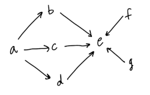

# Virgo Configuration Language

Most configuration problems reduce to graphs, e.g. Dockerfiles and Makefiles

But there are no graph-based configuration languages. So virgo is an attempt to make a programming language that optimizes for natural graph readability, editability, and representation.

Imagine dot language, but focused on config instead of presentation.


Virgo is a graph-based configuration language. It has two main features: edge definitions and vertex definitions. The Virgo configuration file then parses into an adjacency list. You can clearly achieve similar results from adding additional conventions and restrictions on YAML or JSON. Much like YAML optimized for human readability, Virgo optimizes for natural graph readability, editability, and representation.

### Go

This repository contains a reference implementation written in Go, with yacc and lex definitions.

### Python

There is a python implementation maintained at [jwg4/pyvirgo](https://github.com/jwg4/pyvirgo) which can also be found on [PyPi](https://pypi.org/project/pyvirgo/).

```go
// config.vgo

a -> b, c, d -> e <- f, g
```



- [Example](#Example)
- [Proposals](#virgo-is-open-for-proposals)
- [Language Reference](#language-reference)
  - [Edge Statement](#edge-statement)
  - [Vertex Statement](#vertex-statement)

## Example

```go
// config.vgo

clean -> parser, lexer -> "src files" -> test

parser = `goyacc parser.y`
lexer  = `golex lex.l`
clean  = `rm lex.yy.go parser.go || true`
"test"   = `go test-v`
"src files"  = `go build ./...`
```

How to parse and topologically sort the graph with the Go library.

```go
package main

import (
	"fmt"
	"io/ioutil"
	"log"
	"os"
	"strings"

	"github.com/pkg/errors"
	"matt-rickard.com/virgo/pkg/virgo"
)

func main() {
	if err := run("config.go"); err != nil {
		log.Fatal(err)
		os.Exit(1)
	}
}

func run(fname string) error {
	f, err := ioutil.ReadFile(fname)
	if err != nil {
		return errors.Wrap(err, "reading file")
	}
	g, err := virgo.Parse(f)
	if err != nil {
		return errors.Wrap(err, "parsing virgo file")
	}

	nodes, err := virgo.TopSort(g)
	if err != nil {
		return errors.Wrap(err, "topological sort")
	}

	out := []string{}
	for _, n := range nodes {
		out = append(out, g.Vertices[n]...)
	}
	fmt.Println(strings.Join(out, "\n"))
	return nil
}
```

How to parse and topologically sort the graph with the Virgo CLI tool

```bash
$ virgo run build.vgo
```

Or topologically sort from a specific vertex

```bash
$ virgo run build.vgo:lexer
```

### Virgo is Open for Proposals

I use virgo in a variety of ways for my own projects. That being said, I'm open to significant language change and feature proposals. Please open up a detailed issue and I'll do my best to respond. I'm also open to taking on more full time maintainers.

### Language Reference

- Newline delimited
- Line contiuations can be created with a `|`
- Single-line comments start with a `//`
- Multi-line block comments start with a `/*` and end with a `*/`

#### Edge Statement

```go

a -> b, c -> d, e <- f <- g
a -> h
b -> h, i

```

- Valid edge operators are right edge `->`, left edge `<-`, and undirected edge `--`
- Multiple edge definitions can be strung together per line
- Multiple endpoints can be specified with a comma `,` on either side of the edge operator

#### Vertex Statement

```go
vertex_definition_1 = `
    anything
    can
    go
    ${here}
`
```

- Vertices do not require a definition
- Vertex definitions lines start with the vertex name, followed by an equal sign `=` followed by a start backtick \`, definition, and then end backtick `` `.
- Vertex definitions are multiline by default and start and end with a backtick `` `
- Vertex definitions valid characters are [a-zA-Z_:0-9] but cannot start with a digit
